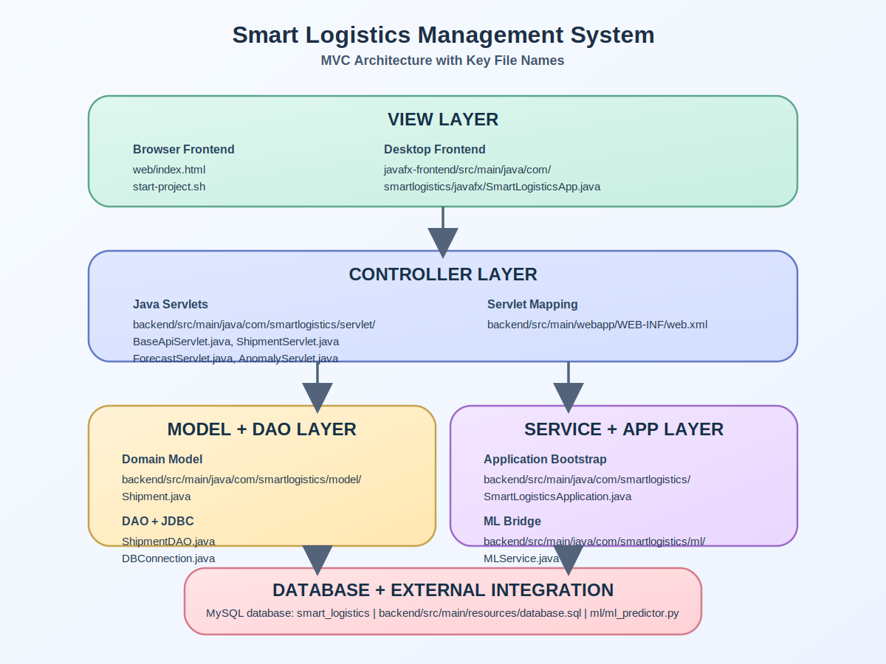
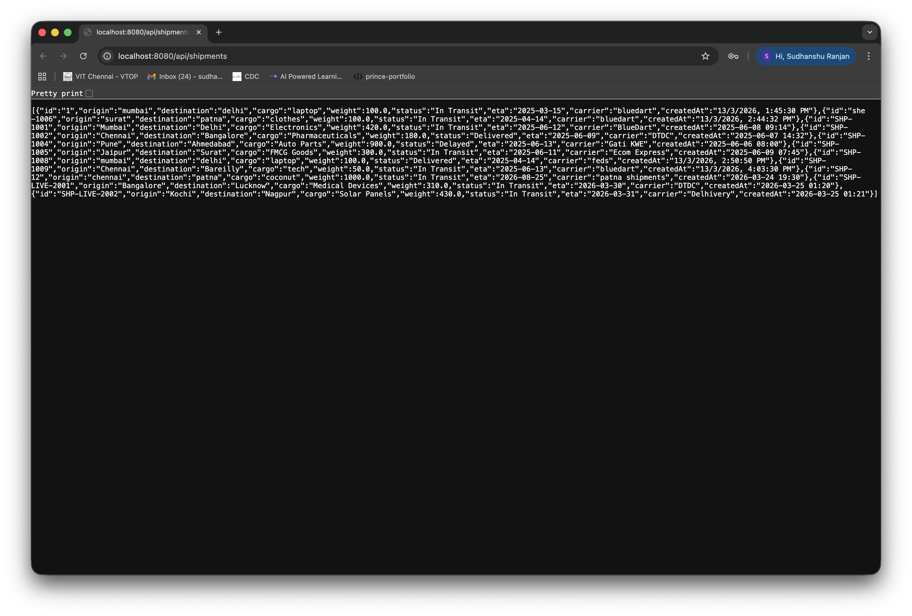
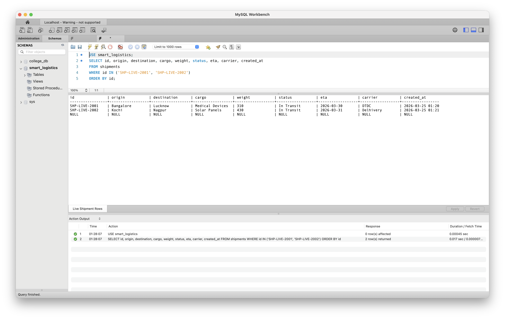
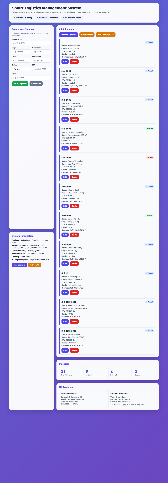
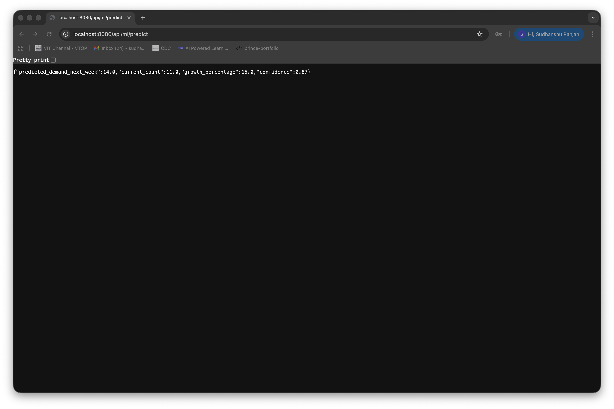
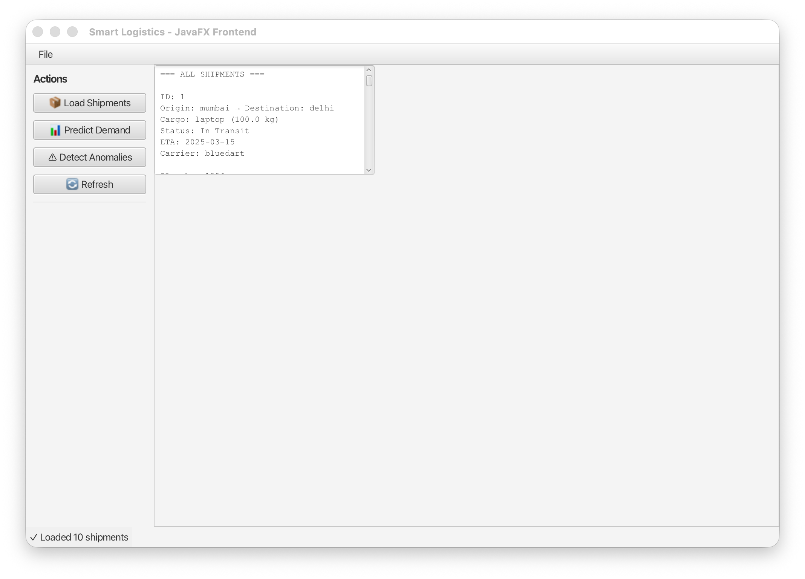
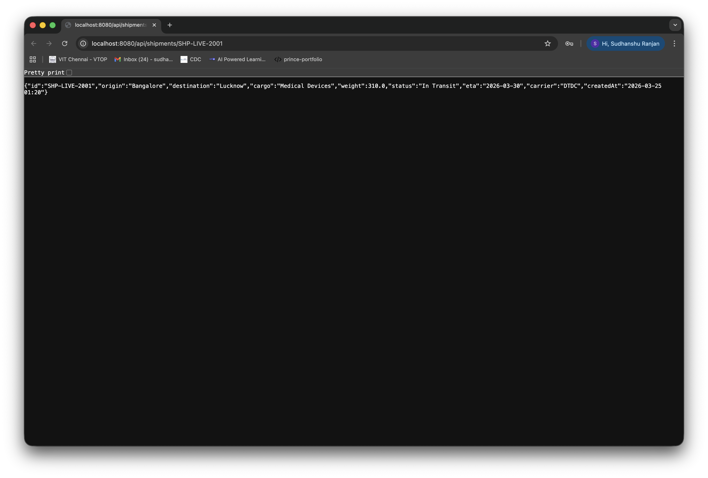
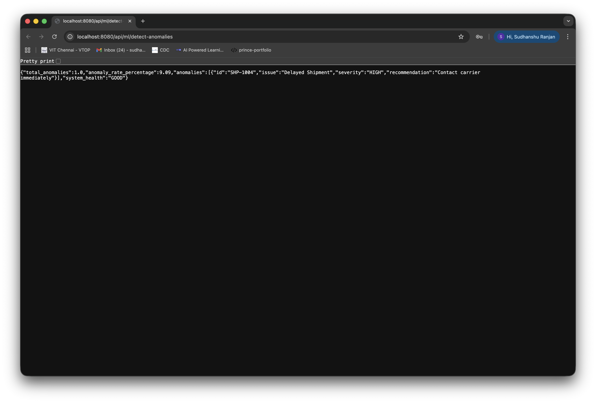
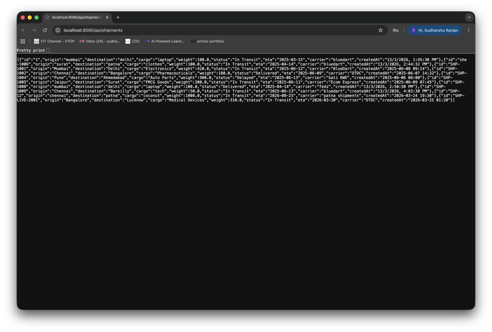
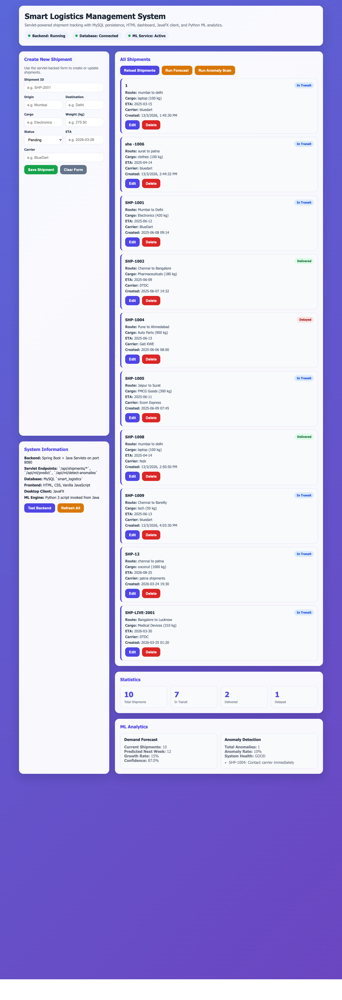

<div class="cover-page">
  <div class="cover-frame">
    <div class="cover-kicker">PROGRESS REVIEW 1 &amp; 2</div>
    <h1>SMART LOGISTICS MANAGEMENT SYSTEM</h1>
    <div class="cover-code">(SMLOG-JAVA)</div>
    <p class="cover-subtitle">Servlet-based shipment tracking platform with MySQL persistence, browser dashboard, JavaFX desktop client, and Python ML integration.</p>

    <div class="cover-box">
      <div><strong>Report Type:</strong> Progress Review Report</div>
      <div><strong>Prepared For:</strong> Review 1 and Review 2 submission requirement</div>
      <div><strong>Implementation Stage:</strong> More than 60% of the project completed</div>
      <div><strong>Date:</strong> 25 March 2026</div>
    </div>
  </div>
</div>

<div class="page-break"></div>

## Title
**Smart Logistics Management System (SMLOG-JAVA)**

## Project Description
Smart Logistics Management System is a Java-based logistics tracking project developed to manage shipment records, expose servlet endpoints, connect with a MySQL back-end database, provide a browser-based interface, and run a JavaFX desktop client from the same data source. The project also integrates a Python machine learning script to predict future shipment demand and detect delayed shipment anomalies.

The implementation prepared for this review demonstrates the core project foundation expected in Progress Review 1 and 2. The application now runs end to end with live CRUD operations, servlet mapping, JDBC-based database access, real-time UI refresh on the HTML dashboard, and a working JavaFX front end.

### Objectives of the Project
- Build a shipment management system using Java and the MVC pattern.
- Use Java Servlets as the controller layer for CRUD and analytics endpoints.
- Use MySQL as the persistent back-end database.
- Provide a browser interface using HTML, CSS, and JavaScript.
- Provide a second front end using JavaFX.
- Integrate Python-based ML logic for demand forecasting and anomaly detection.

### Major Technologies Used
- Java 17
- Spring Boot embedded Tomcat runtime
- Jakarta Servlet API
- MySQL with JDBC
- HTML, CSS, and Vanilla JavaScript
- JavaFX
- Python 3 for machine learning support

<div class="page-break"></div>

## Project Architecture Diagram as MVC with All the File Names in the Layers



### Architecture Explanation
- **View Layer:** [web/index.html](/Users/sudhanshu/Downloads/SMLOG-java/web/index.html) provides the browser dashboard, while [SmartLogisticsApp.java](/Users/sudhanshu/Downloads/SMLOG-java/javafx-frontend/src/main/java/com/smartlogistics/javafx/SmartLogisticsApp.java) provides the desktop interface.
- **Controller Layer:** [ShipmentServlet.java](/Users/sudhanshu/Downloads/SMLOG-java/backend/src/main/java/com/smartlogistics/servlet/ShipmentServlet.java), [ForecastServlet.java](/Users/sudhanshu/Downloads/SMLOG-java/backend/src/main/java/com/smartlogistics/servlet/ForecastServlet.java), and [AnomalyServlet.java](/Users/sudhanshu/Downloads/SMLOG-java/backend/src/main/java/com/smartlogistics/servlet/AnomalyServlet.java) receive client requests and return JSON responses.
- **Model Layer:** [Shipment.java](/Users/sudhanshu/Downloads/SMLOG-java/backend/src/main/java/com/smartlogistics/model/Shipment.java), [ShipmentDAO.java](/Users/sudhanshu/Downloads/SMLOG-java/backend/src/main/java/com/smartlogistics/dao/ShipmentDAO.java), and [DBConnection.java](/Users/sudhanshu/Downloads/SMLOG-java/backend/src/main/java/com/smartlogistics/dao/DBConnection.java) manage data and database communication.
- **Service and Integration Layer:** [MLService.java](/Users/sudhanshu/Downloads/SMLOG-java/backend/src/main/java/com/smartlogistics/ml/MLService.java), [SmartLogisticsApplication.java](/Users/sudhanshu/Downloads/SMLOG-java/backend/src/main/java/com/smartlogistics/SmartLogisticsApplication.java), [web.xml](/Users/sudhanshu/Downloads/SMLOG-java/backend/src/main/webapp/WEB-INF/web.xml), and `ml/ml_predictor.py` support application startup, servlet registration, and ML execution.

<div class="page-break"></div>

## Modules Description

### Module 1. Servlet Backend Module
The servlet backend is the controller core of the project. It receives requests from the browser dashboard and JavaFX application, validates the request path or payload, and then calls the DAO or ML layer before returning structured JSON responses.



*Figure 1. Shipment servlet list endpoint running live in the browser.*

#### Main files used in this module
- [BaseApiServlet.java](/Users/sudhanshu/Downloads/SMLOG-java/backend/src/main/java/com/smartlogistics/servlet/BaseApiServlet.java)
- [ShipmentServlet.java](/Users/sudhanshu/Downloads/SMLOG-java/backend/src/main/java/com/smartlogistics/servlet/ShipmentServlet.java)
- [ForecastServlet.java](/Users/sudhanshu/Downloads/SMLOG-java/backend/src/main/java/com/smartlogistics/servlet/ForecastServlet.java)
- [AnomalyServlet.java](/Users/sudhanshu/Downloads/SMLOG-java/backend/src/main/java/com/smartlogistics/servlet/AnomalyServlet.java)
- [web.xml](/Users/sudhanshu/Downloads/SMLOG-java/backend/src/main/webapp/WEB-INF/web.xml)

#### Functions completed
- Listing all shipments through `GET /api/shipments`
- Fetching one shipment by ID through `GET /api/shipments/{id}`
- Creating a shipment through `POST /api/shipments`
- Updating a shipment through `PUT /api/shipments/{id}`
- Deleting a shipment through `DELETE /api/shipments/{id}`
- Serving ML endpoints through `/api/ml/predict` and `/api/ml/detect-anomalies`

<div class="page-break"></div>

### Code Snippet 1. Shipment Servlet
```java
@WebServlet(name = "ShipmentServlet", urlPatterns = {"/api/shipments/*"})
public class ShipmentServlet extends BaseApiServlet {

    @Override
    protected void doGet(HttpServletRequest request, HttpServletResponse response) throws IOException {
        try {
            String shipmentId = extractShipmentId(request);
            if (shipmentId == null) {
                writeJson(response, HttpServletResponse.SC_OK, ShipmentDAO.getAllShipments());
                return;
            }

            Shipment shipment = ShipmentDAO.getShipmentById(shipmentId);
            if (shipment == null) {
                writeError(response, HttpServletResponse.SC_NOT_FOUND, "Shipment not found: " + shipmentId);
                return;
            }

            writeJson(response, HttpServletResponse.SC_OK, shipment);
        } catch (SQLException e) {
            writeError(response, HttpServletResponse.SC_INTERNAL_SERVER_ERROR,
                "Unable to fetch shipment data: " + e.getMessage());
        }
    }

    @Override
    protected void doDelete(HttpServletRequest request, HttpServletResponse response) throws IOException {
        String shipmentId = extractShipmentId(request);
        boolean deleted = ShipmentDAO.deleteShipment(shipmentId);
        writeJson(response, HttpServletResponse.SC_OK, Map.of(
            "message", "Shipment deleted successfully",
            "id", shipmentId
        ));
    }
}
```

### Code Snippet 2. Servlet Mapping in `web.xml`
```xml
<servlet>
    <servlet-name>ShipmentServlet</servlet-name>
    <servlet-class>com.smartlogistics.servlet.ShipmentServlet</servlet-class>
    <load-on-startup>1</load-on-startup>
</servlet>
<servlet-mapping>
    <servlet-name>ShipmentServlet</servlet-name>
    <url-pattern>/api/shipments/*</url-pattern>
</servlet-mapping>

<servlet>
    <servlet-name>ForecastServlet</servlet-name>
    <servlet-class>com.smartlogistics.servlet.ForecastServlet</servlet-class>
</servlet>
<servlet-mapping>
    <servlet-name>ForecastServlet</servlet-name>
    <url-pattern>/api/ml/predict</url-pattern>
</servlet-mapping>
```

<div class="page-break"></div>

### Module 2. Back-End Database Module
The database module connects the project to MySQL and performs all CRUD operations using raw JDBC. It also ensures that the `smart_logistics` database and `shipments` table exist before the application begins serving data.



*Figure 2. MySQL Workbench showing the live `shipments` table after servlet operations.*

#### Main files used in this module
- [DBConnection.java](/Users/sudhanshu/Downloads/SMLOG-java/backend/src/main/java/com/smartlogistics/dao/DBConnection.java)
- [ShipmentDAO.java](/Users/sudhanshu/Downloads/SMLOG-java/backend/src/main/java/com/smartlogistics/dao/ShipmentDAO.java)
- [database.sql](/Users/sudhanshu/Downloads/SMLOG-java/backend/src/main/resources/database.sql)

#### Functions completed
- Creating database and table automatically if not available
- Seeding initial shipment data
- Reading all shipments
- Reading a shipment by ID
- Inserting new shipments
- Updating shipment details
- Deleting shipments from the database

<div class="page-break"></div>

### Code Snippet 3. Database Initialization
```java
private static void ensureSchema() throws SQLException {
    try (Connection conn = DriverManager.getConnection(ROOT_URL, USER, PASSWORD);
         Statement stmt = conn.createStatement()) {
        stmt.executeUpdate("CREATE DATABASE IF NOT EXISTS smart_logistics");
    }

    try (Connection conn = DriverManager.getConnection(DATABASE_URL, USER, PASSWORD);
         Statement stmt = conn.createStatement()) {
        stmt.executeUpdate(
            "CREATE TABLE IF NOT EXISTS shipments (" +
                "id VARCHAR(20) PRIMARY KEY," +
                "origin VARCHAR(100) NOT NULL," +
                "destination VARCHAR(100) NOT NULL," +
                "cargo VARCHAR(100) NOT NULL," +
                "weight DECIMAL(10,2) NOT NULL," +
                "status ENUM('Pending','In Transit','Delivered','Delayed') DEFAULT 'Pending'," +
                "eta VARCHAR(20)," +
                "carrier VARCHAR(100)," +
                "created_at VARCHAR(50)" +
            ")"
        );
    }
}
```

### Code Snippet 4. JDBC CRUD Logic
```java
public static boolean updateShipment(String id, Shipment shipment) throws SQLException {
    String query = "UPDATE shipments SET origin=?, destination=?, cargo=?, weight=?, status=?, eta=?, carrier=? WHERE id=?";

    try (Connection conn = DBConnection.getConnection();
         PreparedStatement stmt = conn.prepareStatement(query)) {
        stmt.setString(1, shipment.getOrigin());
        stmt.setString(2, shipment.getDestination());
        stmt.setString(3, shipment.getCargo());
        stmt.setDouble(4, shipment.getWeight());
        stmt.setString(5, shipment.getStatus());
        stmt.setString(6, shipment.getEta());
        stmt.setString(7, shipment.getCarrier());
        stmt.setString(8, id);
        return stmt.executeUpdate() > 0;
    }
}
```

<div class="page-break"></div>

### Module 3. HTML Dashboard Module
The HTML dashboard is the browser-based view layer of the project. It loads shipment data from the servlet API, displays live statistics, provides create, update, and delete operations, and calls the analytics endpoints for prediction and anomaly detection.



*Figure 3. Browser dashboard showing servlet-backed shipment cards and statistics.*

#### Main files used in this module
- [index.html](/Users/sudhanshu/Downloads/SMLOG-java/web/index.html)
- [start-project.sh](/Users/sudhanshu/Downloads/SMLOG-java/start-project.sh)
- [stop-project.sh](/Users/sudhanshu/Downloads/SMLOG-java/stop-project.sh)

#### Functions completed
- Displaying shipment cards
- Showing total, in-transit, delivered, and delayed counts
- Adding new shipments from the form
- Editing existing shipments
- Deleting shipments with live refresh
- Calling forecast and anomaly servlet endpoints

<div class="page-break"></div>

### Code Snippet 5. Dashboard Fetch and Refresh Logic
```html
<script>
const API_URL = "http://localhost:8080/api";

async function loadShipments() {
    const shipments = await parseJsonResponse(await fetch(`${API_URL}/shipments`));
    updateStats(shipments);
    document.getElementById("shipments").innerHTML = shipments.map(shipment => `
        <div class="shipment-card">
            <div class="shipment-id">${escapeHtml(shipment.id)}</div>
            <div><strong>Route:</strong> ${escapeHtml(shipment.origin)} to ${escapeHtml(shipment.destination)}</div>
            <div><strong>Cargo:</strong> ${escapeHtml(shipment.cargo)} (${escapeHtml(shipment.weight)} kg)</div>
            <button class="danger" onclick="deleteShipment('${escapeHtml(shipment.id)}')">Delete</button>
        </div>
    `).join("");
}

async function saveShipment() {
    const endpoint = editingShipmentId ? `${API_URL}/shipments/${editingShipmentId}` : `${API_URL}/shipments`;
    const method = editingShipmentId ? "PUT" : "POST";
    await parseJsonResponse(await fetch(endpoint, {
        method,
        headers: { "Content-Type": "application/json" },
        body: JSON.stringify(shipment)
    }));
    await refreshPage();
}
</script>
```

<div class="page-break"></div>

### Module 4. Machine Learning Integration Module
The ML module connects Java with Python. It uses `ProcessBuilder` to invoke the Python script, receive a JSON result, and return that result through servlet endpoints. This makes the analytics part of the project accessible from both the web dashboard and JavaFX front end.



*Figure 4. Live forecast response returned from the servlet-backed analytics endpoint.*

#### Main files used in this module
- [MLService.java](/Users/sudhanshu/Downloads/SMLOG-java/backend/src/main/java/com/smartlogistics/ml/MLService.java)
- [ForecastServlet.java](/Users/sudhanshu/Downloads/SMLOG-java/backend/src/main/java/com/smartlogistics/servlet/ForecastServlet.java)
- [AnomalyServlet.java](/Users/sudhanshu/Downloads/SMLOG-java/backend/src/main/java/com/smartlogistics/servlet/AnomalyServlet.java)
- `ml/ml_predictor.py`

#### Functions completed
- Calling the Python prediction script from Java
- Passing shipment count for demand prediction
- Passing shipment list for anomaly detection
- Returning JSON back to the servlet layer
- Displaying prediction and anomaly results in the front ends

<div class="page-break"></div>

### Code Snippet 6. Java to Python ML Bridge
```java
public static Map<String, Object> predictDemand(int shipmentCount) {
    try {
        ProcessBuilder pb = new ProcessBuilder(
            "python3", resolveScriptPath().toString(), "predict", String.valueOf(shipmentCount)
        );
        pb.redirectErrorStream(true);
        Process process = pb.start();

        String result = readProcessOutput(process);
        int exitCode = process.waitFor();
        if (exitCode != 0) {
            return Map.of("error", "ML Service exited with code " + exitCode + ": " + result);
        }

        return gson.fromJson(result, Map.class);
    } catch (Exception e) {
        return Map.of("error", "ML Service failed: " + e.getMessage());
    }
}
```

### Code Snippet 7. Forecast Servlet
```java
@WebServlet(name = "ForecastServlet", urlPatterns = {"/api/ml/predict"})
public class ForecastServlet extends BaseApiServlet {

    @Override
    protected void doGet(HttpServletRequest request, HttpServletResponse response) throws IOException {
        try {
            List<Shipment> shipments = ShipmentDAO.getAllShipments();
            Map<String, Object> prediction = MLService.predictDemand(shipments.size());
            writeJson(response, HttpServletResponse.SC_OK, prediction);
        } catch (SQLException e) {
            writeError(response, HttpServletResponse.SC_INTERNAL_SERVER_ERROR,
                "Unable to generate forecast: " + e.getMessage());
        }
    }
}
```

<div class="page-break"></div>

### Module 5. JavaFX Desktop Frontend Module
The JavaFX module acts as a desktop version of the project. It consumes the same servlet endpoints and allows the user to load shipment data, run demand prediction, and detect anomalies in a standalone Java application.



*Figure 5. JavaFX desktop client connected to the same servlet backend.*

#### Main files used in this module
- [SmartLogisticsApp.java](/Users/sudhanshu/Downloads/SMLOG-java/javafx-frontend/src/main/java/com/smartlogistics/javafx/SmartLogisticsApp.java)
- [pom.xml](/Users/sudhanshu/Downloads/SMLOG-java/javafx-frontend/pom.xml)

#### Functions completed
- Loading all shipments from the backend API
- Showing formatted shipment details in the desktop window
- Running demand prediction from the same backend
- Running anomaly detection from the same backend
- Refreshing data without restarting the application

<div class="page-break"></div>

### Code Snippet 8. JavaFX API Consumption
```java
private void loadShipments() {
    new Thread(() -> {
        try {
            updateStatus("Loading shipments...");
            String response = callAPI("/shipments");
            JSONArray shipments = new JSONArray(response);

            StringBuilder output = new StringBuilder();
            output.append("=== ALL SHIPMENTS ===\n\n");
            for (int i = 0; i < shipments.length(); i++) {
                JSONObject ship = shipments.getJSONObject(i);
                output.append(String.format(
                    "ID: %s\nOrigin: %s → Destination: %s\nCargo: %s (%s kg)\nStatus: %s\nETA: %s\nCarrier: %s\n\n",
                    ship.getString("id"),
                    ship.getString("origin"),
                    ship.getString("destination"),
                    ship.getString("cargo"),
                    ship.getDouble("weight"),
                    ship.getString("status"),
                    ship.getString("eta"),
                    ship.getString("carrier")
                ));
            }
            displayArea.setText(output.toString());
            updateStatus("✓ Loaded " + shipments.length() + " shipments");
        } catch (Exception e) {
            displayArea.setText("Error loading shipments: " + e.getMessage());
        }
    }).start();
}
```

<div class="page-break"></div>

## Modules Completed
The following modules are completed and demonstrated as part of this review:

| Module | Main Outcome | Status |
| --- | --- | --- |
| Servlet Backend | Shipment CRUD and analytics endpoints are working | Completed |
| Database Module | MySQL schema, table access, and live updates are working | Completed |
| HTML Dashboard | Browser UI with create, update, delete, stats, and analytics | Completed |
| ML Module | Forecast and anomaly detection integrated through Python | Completed |
| JavaFX Frontend | Desktop client connected to the same backend | Completed |

### Submission Checklist for Review Requirement
#### JavaFX Code
- [SmartLogisticsApp.java](/Users/sudhanshu/Downloads/SMLOG-java/javafx-frontend/src/main/java/com/smartlogistics/javafx/SmartLogisticsApp.java)
- [javafx-frontend/pom.xml](/Users/sudhanshu/Downloads/SMLOG-java/javafx-frontend/pom.xml)

#### Servlet Code
- [BaseApiServlet.java](/Users/sudhanshu/Downloads/SMLOG-java/backend/src/main/java/com/smartlogistics/servlet/BaseApiServlet.java)
- [ShipmentServlet.java](/Users/sudhanshu/Downloads/SMLOG-java/backend/src/main/java/com/smartlogistics/servlet/ShipmentServlet.java)
- [ForecastServlet.java](/Users/sudhanshu/Downloads/SMLOG-java/backend/src/main/java/com/smartlogistics/servlet/ForecastServlet.java)
- [AnomalyServlet.java](/Users/sudhanshu/Downloads/SMLOG-java/backend/src/main/java/com/smartlogistics/servlet/AnomalyServlet.java)
- [web.xml](/Users/sudhanshu/Downloads/SMLOG-java/backend/src/main/webapp/WEB-INF/web.xml)

#### Back-End DB Files
- [DBConnection.java](/Users/sudhanshu/Downloads/SMLOG-java/backend/src/main/java/com/smartlogistics/dao/DBConnection.java)
- [ShipmentDAO.java](/Users/sudhanshu/Downloads/SMLOG-java/backend/src/main/java/com/smartlogistics/dao/ShipmentDAO.java)
- [database.sql](/Users/sudhanshu/Downloads/SMLOG-java/backend/src/main/resources/database.sql)

#### HTML Files
- [index.html](/Users/sudhanshu/Downloads/SMLOG-java/web/index.html)
- [start-project.sh](/Users/sudhanshu/Downloads/SMLOG-java/start-project.sh)
- [stop-project.sh](/Users/sudhanshu/Downloads/SMLOG-java/stop-project.sh)

<div class="page-break"></div>

## Execution Screenshots

### 1. Dashboard Before Delete


### 2. Updated Single Shipment via Servlet


### 3. Forecast Endpoint Running


### 4. Anomaly Endpoint Running


### 5. MySQL Workbench Before Delete


### 6. Shipment Servlet List After Delete


### 7. MySQL Workbench After Delete


### 8. Dashboard After Delete


### 9. JavaFX Desktop Frontend Running


<div class="page-break"></div>

## Current Status
The project is currently in a strong implementation state for Progress Review 1 and 2. More than 60% of the complete project work has been implemented and demonstrated. The servlet backend is running, the MySQL database is updating live, the HTML dashboard is performing add, update, and delete operations, the machine learning endpoints are responding, and the JavaFX desktop application is connected to the same backend.

The work completed so far satisfies the review requirement for implementation evidence, servlet code submission, JavaFX code submission, back-end database submission, HTML file submission, architecture representation, module explanation, execution screenshots, and current progress reporting.

## Summary
Smart Logistics Management System has been successfully developed as a multi-layer Java application based on the MVC model. The project combines Java Servlets, MySQL, HTML, JavaFX, and Python ML into one working system. During this review stage, the major modules required for shipment management and analytics have been completed and tested with live evidence.

The report presents the project in the required review format with title, project description, architecture diagram, module descriptions, completed modules, execution screenshots, current status, and summary. Code snippets from the real project files are also included to show the actual implementation used in the system.
